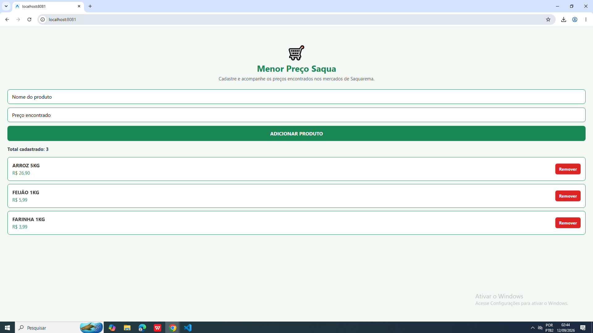
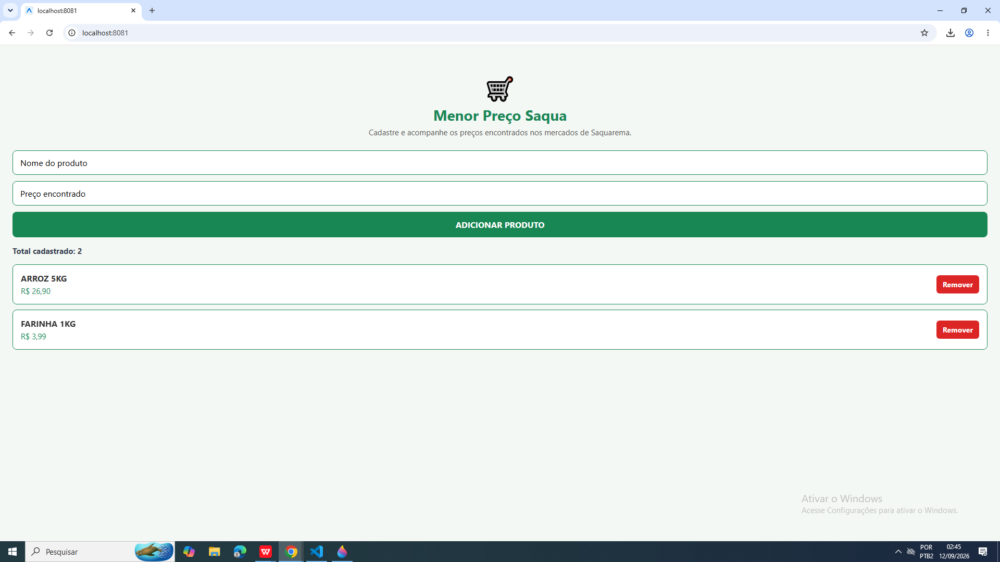
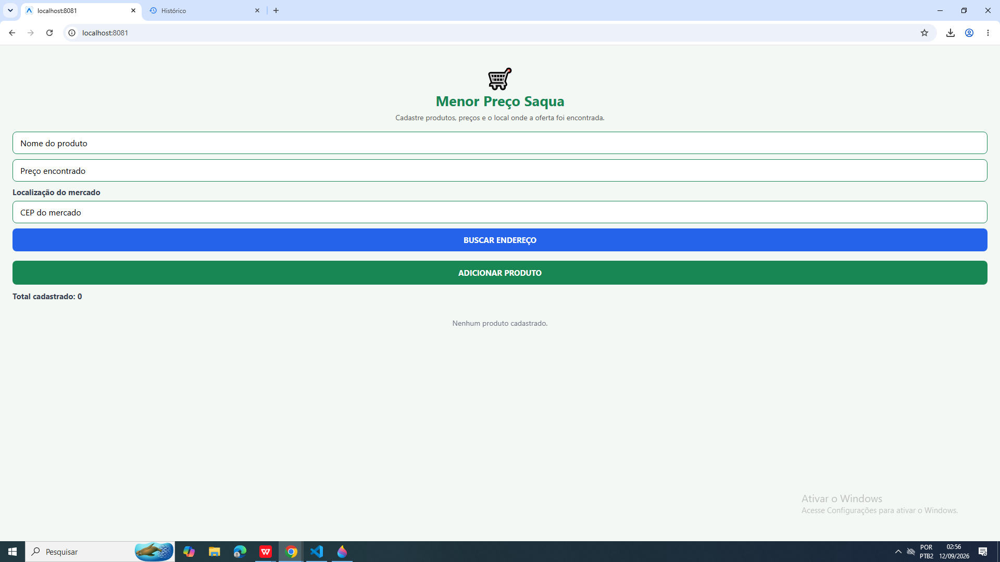
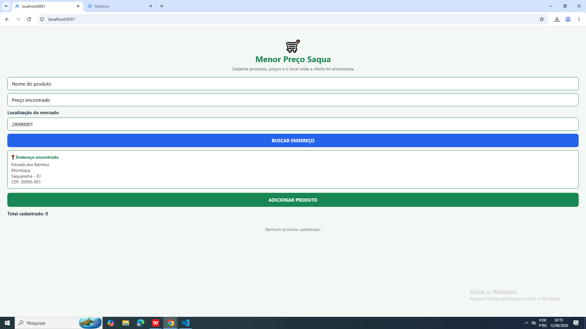
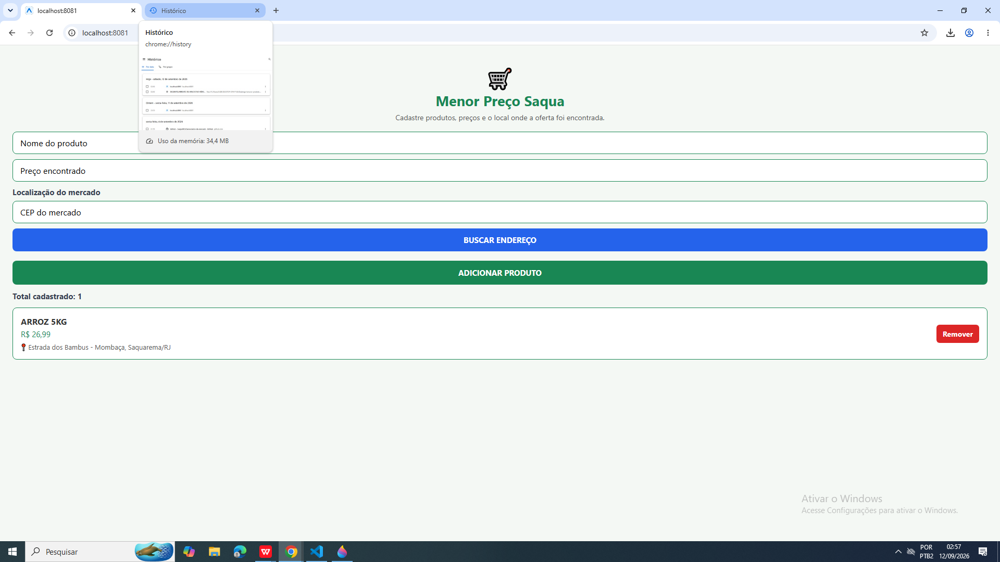

# Menor Preço Saqua

Aplicativo híbrido desenvolvido na disciplina de Laboratório de Desenvolvimento de Aplicativos Híbridos.

O projeto vem sendo desenvolvido de forma incremental ao longo das aulas, aplicando conceitos de React Native, gerenciamento de estado, componentes reutilizáveis, listas e integração com APIs REST.

---

## Problema

Em Saquarema existem diversos mercados com preços competitivos e promoções diferentes. Muitas vezes, o consumidor precisa procurar em vários estabelecimentos para descobrir onde determinado produto está mais barato.

---

## Proposta

O Menor Preço Saqua busca facilitar a consulta e o compartilhamento de preços e promoções dos mercados de Saquarema, auxiliando os consumidores na busca por opções mais econômicas.

---

## Objetivo

Desenvolver um aplicativo híbrido que auxilie consumidores a localizar e compartilhar os menores preços encontrados nos mercados de Saquarema.

---

## Público-alvo

Moradores e consumidores de Saquarema que desejam economizar nas compras realizadas em supermercados da região.

---

# Evolução do Projeto

## Aulas 2 e 3 — Proposta e Primeiro MVP

Nas primeiras etapas foi definida a ideia do aplicativo Menor Preço Saqua, partindo do problema da variação de preços e promoções entre os mercados de Saquarema.

Foi desenvolvido o primeiro MVP com uma tela para cadastro de produtos e preços.

### Funcionalidades desenvolvidas

- Campo para informar o nome do produto;
- Campo para informar o preço encontrado;
- Cadastro de produto e preço;
- Cadastro de vários produtos;
- Exibição dos produtos cadastrados;
- Limpeza dos campos após o cadastro;
- Limpeza da lista de produtos;
- Validação dos campos obrigatórios;
- Mensagem de erro quando o usuário tenta cadastrar sem preencher os dados necessários.

### Prints da aplicação — Aulas 2 e 3

#### Tela inicial


#### Produtos cadastrados


#### Validação dos campos


---

## Aula 4 — Componentes, Estado e Listas

Na Aula 4, o projeto foi aprimorado com a aplicação de conceitos importantes do React Native.

O cadastro de produtos passou a utilizar gerenciamento de estado e uma lista dinâmica para apresentar os itens cadastrados.

### Funcionalidades e conceitos aplicados

- Utilização do `useState`;
- Utilização de `TextInput`;
- Botões funcionais;
- Validação de campos vazios;
- Cadastro temporário dos produtos em memória;
- Utilização de `FlatList`;
- Exibição dinâmica dos produtos cadastrados;
- Remoção individual de produtos;
- Criação de componente reutilizável;
- Organização do projeto em componentes, telas e serviços.

### Organização utilizada

```text
src/
├── components/
│   └── ProdutoItem.tsx
├── screens/
│   └── CadastroProdutoScreen.tsx
└── services/
```

O componente `ProdutoItem` ficou responsável pela apresentação de cada produto da lista e pela opção de removê-lo.

### Prints da aplicação — Aula 4

#### Cadastro de vários produtos



#### Remoção de produtos



---

## Aula 5 — Integração com API REST

Na Aula 5, o aplicativo passou a consumir uma API REST pública, permitindo utilizar informações externas dentro da aplicação.

A API escolhida foi a ViaCEP, pois a consulta de endereço possui relação direta com a proposta do Menor Preço Saqua.

O usuário informa o CEP do mercado onde encontrou determinado preço e o aplicativo realiza uma consulta para localizar automaticamente o endereço.

### API utilizada

ViaCEP

A API é utilizada para consultar informações de endereço a partir do CEP informado pelo usuário.

### Funcionalidades implementadas

- Campo para informar o CEP do mercado;
- Consulta de CEP;
- Requisição HTTP utilizando o método `GET`;
- Consumo de API REST pública;
- Utilização de `fetch`;
- Processamento da resposta em formato JSON;
- Exibição do endereço retornado pela API;
- Validação do CEP informado;
- Indicador de carregamento durante a consulta;
- Tratamento de erros;
- Associação do endereço encontrado ao produto cadastrado.

### Fluxo da integração

```text
Usuário informa o CEP
        ↓
Aplicativo realiza uma requisição GET
        ↓
ViaCEP recebe a solicitação
        ↓
API retorna os dados em JSON
        ↓
Aplicativo processa os dados
        ↓
Endereço é exibido na interface
        ↓
Produto é cadastrado com preço e localização
```

### Serviço da API

A integração com a ViaCEP foi separada em um serviço:

```text
src/services/viacep.ts
```

Essa organização ajuda a separar a comunicação com a API da interface da aplicação.

### Prints da aplicação — Aula 5

#### Consulta do CEP do mercado



#### Endereço encontrado pela ViaCEP



#### Produto cadastrado com localização



---

# Funcionalidades atuais

Até a Aula 5, o **Menor Preço Saqua** possui:

- Cadastro do nome do produto;
- Cadastro do preço encontrado;
- Cadastro de vários produtos;
- Exibição dos produtos em lista;
- Contador de produtos cadastrados;
- Remoção individual de produtos;
- Validação dos campos;
- Consulta de CEP;
- Busca automática do endereço do mercado;
- Integração com API REST;
- Processamento de dados JSON;
- Indicador de carregamento;
- Tratamento de erros;
- Exibição da localização associada ao produto.

> Atualmente, os produtos cadastrados são mantidos temporariamente em memória durante a execução do aplicativo.

---

# Tecnologias utilizadas

- React Native;
- TypeScript;
- Expo;
- Expo Router;
- `fetch`;
- API REST;
- ViaCEP;
- Git;
- GitHub.

---

# Estrutura principal do projeto

```text
Gerenciador-de-mercado-final/
├── app/
│   └── (tabs)/
│       └── index.tsx
│
├── src/
│   ├── components/
│   │   └── ProdutoItem.tsx
│   │
│   ├── screens/
│   │   └── CadastroProdutoScreen.tsx
│   │
│   └── services/
│       └── viacep.ts
│
├── assets/
├── package.json
└── README.md
```

---

# Integrantes

- Heloísa Alice
- Rafael Farias
- Paulo Sérgio
- Leonardo Velloso

---

# Status

Projeto em desenvolvimento.

O aplicativo está sendo evoluído de acordo com as atividades propostas durante as aulas da disciplina.

---

# Histórico de desenvolvimento

| Etapa | Desenvolvimento |
|---|---|
| Aulas 2 e 3 | Definição do problema, proposta e desenvolvimento do primeiro MVP |
| Aula 4 | `useState`, `TextInput`, validações, `FlatList`, remoção e componente reutilizável |
| Aula 5 | Integração com API REST ViaCEP, requisição `GET`, JSON, loading e tratamento de erros |

---

# Próximas etapas

O projeto continuará sendo aprimorado nas próximas aulas, adicionando novas funcionalidades de acordo com a evolução da disciplina.
