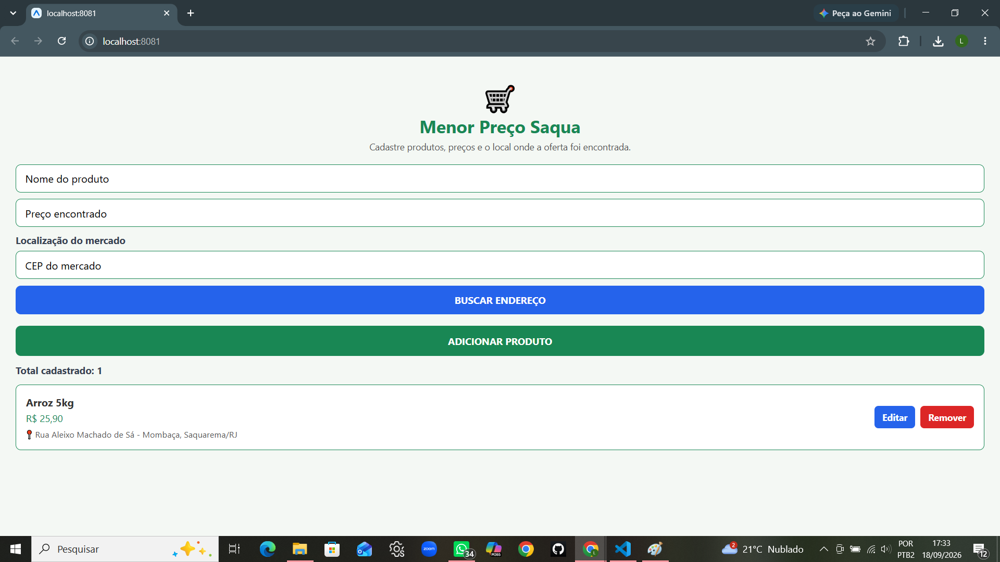
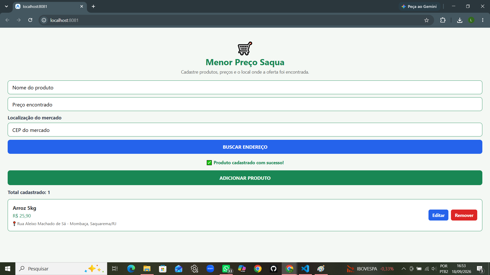
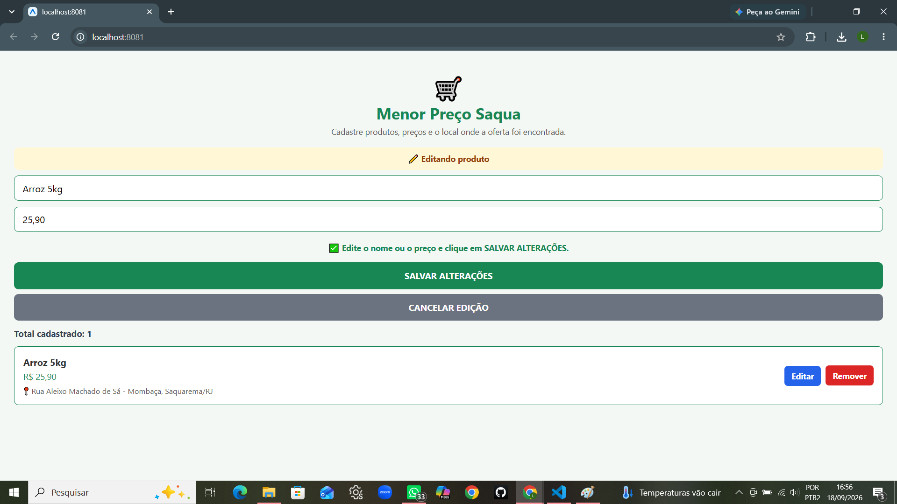
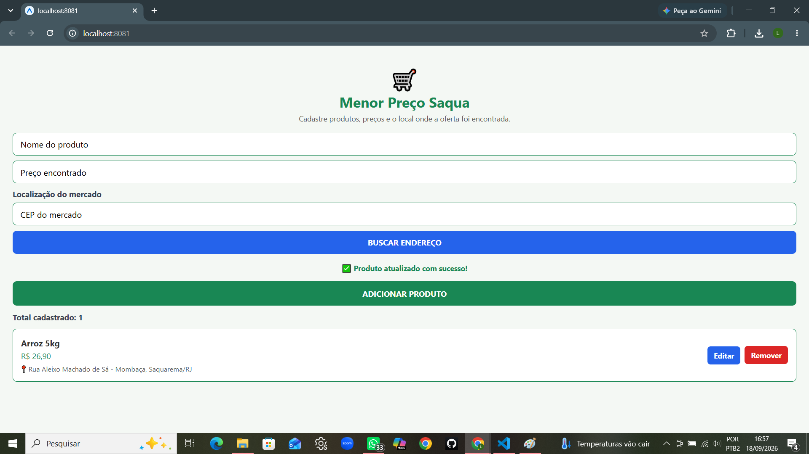
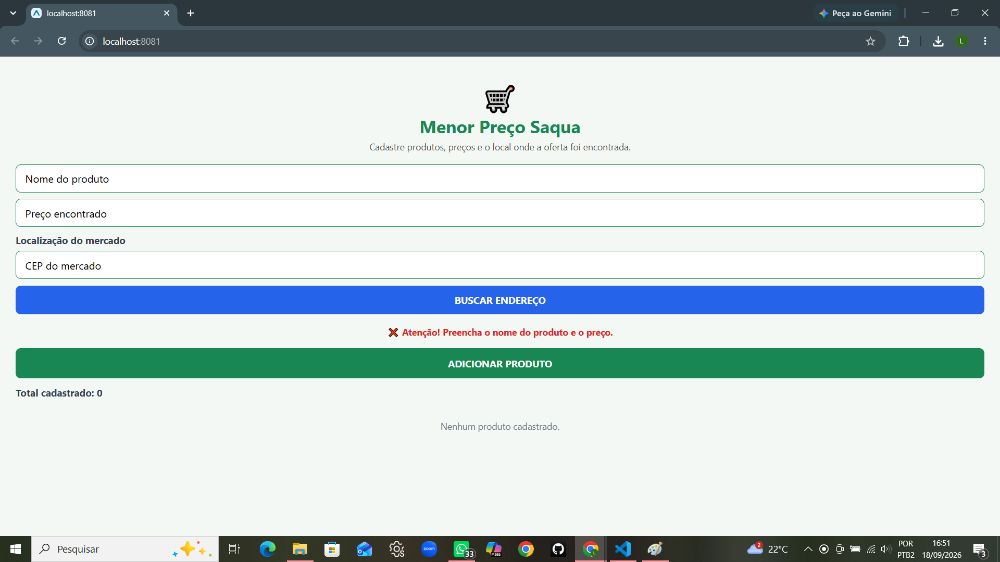
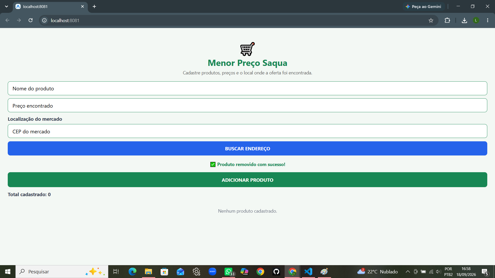
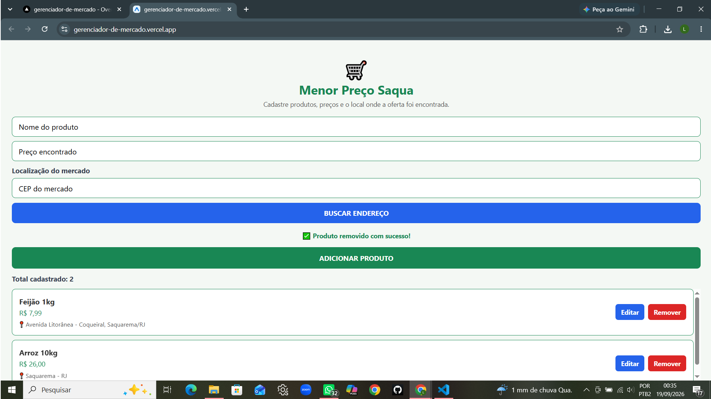
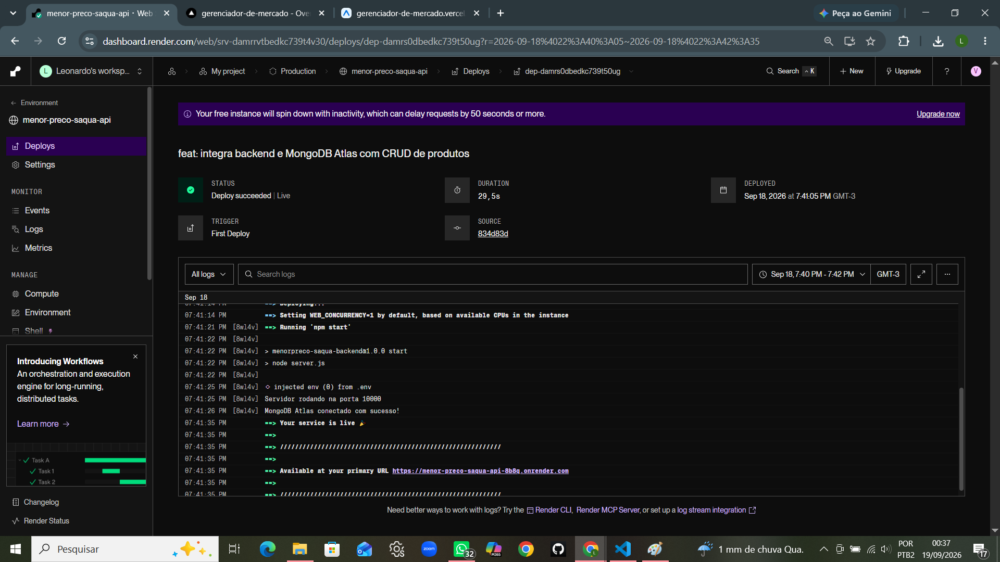
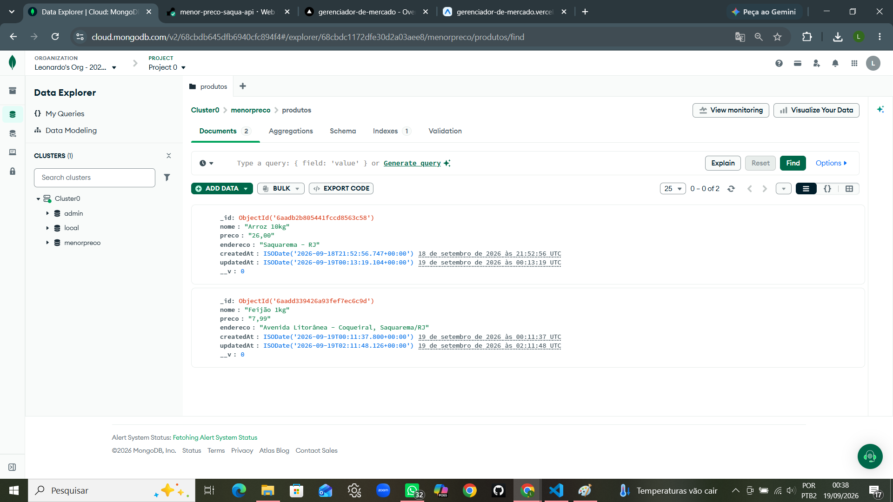

# Menor Preço Saqua

Aplicativo híbrido desenvolvido na disciplina de Laboratório de Desenvolvimento de Aplicativos Híbridos.

O projeto vem sendo desenvolvido de forma incremental ao longo das aulas, aplicando conceitos de React Native, gerenciamento de estado, componentes reutilizáveis, listas e integração com APIs REST.

---

## Problema

Em Saquarema existem diversos mercados com preços competitivos e promoções diferentes. Muitas vezes, o consumidor precisa procurar em vários estabelecimentos para descobrir onde determinado produto está mais barato.

---

## Proposta

O **Menor Preço Saqua** busca facilitar a consulta e o compartilhamento de preços e promoções dos mercados de Saquarema, auxiliando os consumidores na busca por opções mais econômicas.

---

## Objetivo

Desenvolver um aplicativo híbrido que auxilie os consumidores a localizar e compartilhar os menores preços encontrados nos mercados de Saquarema.

---

## Público-alvo

Moradores e consumidores de Saquarema que desejam economizar nas compras realizadas em supermercados da região.

---

# Evolução do Projeto

## Aulas 2 e 3 — Proposta e Primeiro MVP

Nas primeiras etapas foi definida a ideia do aplicativo **Menor Preço Saqua**, partindo do problema da variação de preços e promoções entre os mercados de Saquarema.

Foi desenvolvido o primeiro MVP com uma tela para cadastro de produtos e preços.

### Funcionalidades

- Campo para informar o nome do produto;
- Campo para informar o preço encontrado;
- Cadastro de produto e preço;
- Cadastro de vários produtos;
- Exibição dos produtos cadastrados;
- Limpeza dos campos após o cadastro;
- Limpeza da lista de produtos;
- Validação dos campos obrigatórios;
- Mensagem de erro quando o usuário tenta cadastrar sem preencher os dados necessários.

### Prints da aplicação — Aulas 2 e 3

#### Tela inicial


#### Produtos cadastrados


#### Validação dos campos


---

## Aula 4 — Componentes, Estado e Listas

Na Aula 4, o projeto foi aprimorado com a aplicação de conceitos importantes do React Native.

O cadastro de produtos passou a utilizar gerenciamento de estado e uma lista dinâmica para apresentar os itens cadastrados.

### Funcionalidades e conceitos aplicados

- Utilização do `useState`;
- Utilização de `TextInput`;
- Botões funcionais;
- Validação de campos vazios;
- Cadastro temporário dos produtos em memória;
- Utilização de `FlatList`;
- Exibição dinâmica dos produtos cadastrados;
- Remoção individual de produtos;
- Criação de componente reutilizável;
- Organização do projeto em componentes, telas e serviços.

### Organização utilizada

```
src/
├── components/
│   └── ProdutoItem.tsx
├── screens/
│   └── CadastroProdutoScreen.tsx
└── services/

```

O componente `ProdutoItem` ficou responsável pela apresentação de cada produto da lista e pela opção de removê-lo.

### Prints da aplicação — Aula 4

#### Cadastro de vários produtos


#### Remoção de produtos


---

## Aula 5 — Integração com API REST

Na Aula 5, o aplicativo passou a consumir uma API REST pública, permitindo utilizar informações externas dentro da aplicação.

A API escolhida foi a **ViaCEP**, pois a consulta de endereço possui relação direta com a proposta do Menor Preço Saqua.

O usuário informa o CEP do mercado onde encontrou determinado preço e o aplicativo realiza uma consulta para localizar automaticamente o endereço.

### API utilizada

**ViaCEP**

A API é utilizada para consultar informações de endereço a partir do CEP informado pelo usuário.

### Funcionalidades implementadas

- Campo para informar o CEP do mercado;
- Consulta de CEP;
- Requisição HTTP utilizando o método `GET`;
- Consumo de API REST pública;
- Utilização de `fetch`;
- Processamento da resposta em formato JSON;
- Exibição do endereço retornado pela API;
- Validação do CEP informado;
- Indicador de carregamento durante a consulta;
- Tratamento de erros durante a consulta;
- Mensagens de sucesso e erro para o usuário;
- Associação do endereço do mercado ao produto cadastrado;
- Exibição da localização junto ao produto na lista.

### Prints da aplicação — Aula 5

#### Consulta de CEP


#### Endereço encontrado pela ViaCEP


#### Produto cadastrado com localização


---

## Aula 6 — Persistência de Dados, Edição e Tratamento de Erros

Na Aula 6, o projeto **Menor Preço Saqua**  foi aprimorado com persistência local dos produtos cadastrados na versão Web da aplicação.

Os dados passaram a ser armazenados utilizando `localStorage`, permitindo que os produtos permaneçam cadastrados mesmo após a atualização da página.

Também foi implementada a edição dos produtos cadastrados, mantendo a funcionalidade de remoção e adicionando novos tratamentos e mensagens de retorno ao usuário.

### Funcionalidades implementadas

- Persistência dos produtos utilizando `localStorage`;
- Conversão dos dados utilizando `JSON.stringify`;
- Recuperação dos dados utilizando `JSON.parse`;
- Recuperação automática dos produtos ao iniciar a aplicação;
- Manutenção dos produtos após atualizar a página;
- Edição do nome e do preço dos produtos cadastrados;
- Remoção dos produtos cadastrados;
- Atualização dos dados persistidos após edição ou remoção;
- Validação dos campos obrigatórios;
- Tratamento de erros utilizando `try`, `catch` e `finally`;
- Mensagens de sucesso e erro para o usuário;
- Indicador de carregamento durante a consulta de CEP;
- Tratamento de falhas durante a consulta a API ViaCEP.

### Testes realizados

Durante os testes da Aula 6 foram verificados:

- Cadastro de produto com localização;
- Persistência do produto após atualizar a página;
- Edição do produto cadastrado;
- Persistência das alterações após atualizar a página;
- Remoção do produto;
- Persistência da remoção após atualizar a página;
- Validação dos campos obrigatórios;
- Consulta de endereço utilizando a API ViaCEP;
- Exibição das mensagens de sucesso e erro.

A persistência com `localStorage` é utilizada na versão Web do aplicativo. Posteriormente, para a entrega da P1, o projeto foi integrado a um backend próprio e a um banco de dados em nuvem.

---

### Prints da aplicação — Aula 6  

#### Persistência dos dados após recarregar a página



#### Produto cadastrado com opções de edição e remoção



#### Edição de produto



#### Produto atualizado



#### Validação dos campos obrigatórios   



#### Remoção de produto



---

# P1 — Hospedagem do Projeto e Banco de Dados em Nuvem

Para a entrega da P1, o **Menor Preço Saqua** foi evoluído para uma arquitetura com frontend, backend e banco de dados em nuvem.

O frontend da aplicação foi publicado no **Vercel**, o backend desenvolvido com **Node.js e Express** foi hospedado no **Render** e a persistência dos produtos passou a ser realizada no **MongoDB Atlas**.

A aplicação também mantém a integração com a API **ViaCEP** para consulta do endereço do mercado a partir do CEP informado pelo usuário.

## Arquitetura da P1

```  text
Usuário
    
Frontend — Expo / React Native Web
Vercel
   
API REST — Node.js / Express
Render
   
MongoDB Atlas
Banco de dados em nuvem

Frontend - ViaCEP
Consulta de endereço
```

## Backend e API REST

Para a P1 foi desenvolvido um backend utilizando Node.js, Express, Mongoose, CORS e Dotenv.

O backend recebe as requisições do frontend e realiza as operações de cadastro, consulta, edição e exclusão dos produtos no MongoDB Atlas.

### Operações CRUD

Operação - Método HTTP - Funcionalidade

Create - `POST` - Cadastrar um produto
Read - `GET` - Listar os produtos cadastrados
Update - `PUT` - Editar um produto
  Delete - `DELETE` - Excluir um produto

### Endpoints

```text
GET    /produtos
POST   /produtos
PUT    /produtos/:id
DELETE /produtos/:id
```

## Banco de dados em nuvem

O **MongoDB Atlas** é utilizado para armazenar os produtos cadastrados. As operações realizadas pela interface são refletidas no banco de dados e os dados permanecem disponíveis mesmo após atualizar ou fechar a aplicação.

## Segurança das credenciais

A conexão utiliza a variável de ambiente `MONGODB_URI`. O arquivo `.env` não é enviado ao repositório público e as credenciais são configuradas por meio de variáveis de ambiente.

## Aplicação publicada

### Frontend — Vercel
https://gerenciador-de-mercado.vercel.app

### Backend — Render
https://menor-preco-saqua-api-8b8q.onrender.com

### Endpoint público de produtos
https://menor-preco-saqua-api-8b8q.onrender.com/produtos

## Testes realizados — P1

- Acesso pela URL pública;
- Comunicação entre frontend e backend;
- Comunicação entre backend e MongoDB Atlas;
- Consulta de endereço utilizando ViaCEP;
- Cadastro e recuperação de produtos;
- Persistência após atualizar a página;
- Edição e persistência da edição;
- Exclusão e persistência da exclusão;
- Sincronização das alterações com o MongoDB Atlas;
- Tratamento de erros e mensagens de retorno ao usuário.

Os testes de cadastro, consulta, edição e exclusão foram realizados com sucesso na aplicação publicada e as alterações foram confirmadas no MongoDB Atlas.

## Prints da aplicação — P1

#### Aplicação publicada no Vercel



#### Backend publicado no Render



#### Produtos armazenados no MongoDB Atlas



---

# Funcionalidades atuais

Atualmente, o Menor Preço Saqua possui:

- Cadastro do nome do produto;
- Cadastro do preço encontrado;
- Cadastro de vários produtos;
- Exibição dos produtos em lista;
- Contador de produtos cadastrados;
- Edição de produtos cadastrados;
- Remoção individual de produtos;
- Validação dos campos obrigatórios;
- Consulta de CEP;
- Busca automática do endereço do mercado;
- Integração com API REST;
- Processamento de dados JSON;
- Indicador de carregamento;
- Tratamento de erros;
- Mensagens de sucesso e erro;
- Exibição da localização associada ao produto;
- Persistência dos produtos utilizando `localStorage` na versão Web;
- Recuperação automática dos produtos após atualizar a página;
- Atualização dos dados persistidos após edição ou remoção;
- Backend próprio desenvolvido com Node.js e Express;
- API REST para gerenciamento dos produtos;
- Operações CRUD de cadastro, consulta, edição e exclusão;
- Persistência dos produtos no MongoDB Atlas;
- Backend hospedado no Render;
- Frontend publicado no Vercel;
- Aplicação disponível por URL pública.

Na Aula 6, o `localStorage` foi utilizado para demonstrar a persistência local na versão Web. Na P1, a aplicação passou a utilizar o MongoDB Atlas para persistência dos produtos em nuvem.

---

# Tecnologias utilizadas

- React Native;
- TypeScript;
- Expo;
- Expo Router;
- `fetch`;
- API REST;
- ViaCEP;
- Node.js;
- Express;
- Mongoose;
- MongoDB Atlas;
- CORS;
- Dotenv;
- Render;
- Vercel;
- Git;
- GitHub.

---

# Estrutura principal do projeto

```text
Gerenciador-de-mercado-final/
├── app/
│   └── (tabs)/
│       └── index.tsx
├── backend/
│   ├── models/
│   │   └── Produto.js
│   ├── package.json
│   ├── package-lock.json
│   └── server.js
├── src/
│   ├── components/
│   │   └── ProdutoItem.tsx
│   ├── screens/
│   │   └── CadastroProdutoScreen.tsx
│   └── services/
│       ├── produtosApi.ts
│       └── viacep.ts
├── assets/
├── .gitignore
├── package.json
└── README.md
```

> O arquivo `backend/.env` existe apenas no ambiente local e não é enviado ao repositório público.

---

# Integrantes

- Heloísa Alice
- Rafael Farias
- Paulo Sérgio
- Leonardo Velloso

---

# Status

**P1 concluída.**

A aplicação possui uma versão Web publicada e funcional, integrada a uma API REST própria e ao MongoDB Atlas para persistência dos produtos em nuvem.

O projeto continuará sendo evoluído de acordo com as próximas atividades propostas durante a disciplina.

---

# Histórico de desenvolvimento

Etapa - Desenvolvimento

Aulas 2 e 3 - Definição do problema, proposta e desenvolvimento do primeiro MVP
Aula 4 - `useState`, `TextInput`, validações, `FlatList`, remoção e componente reutilizável
Aula 5 - Integração com API REST ViaCEP, requisição `GET`, JSON, loading e tratamento de erros
Aula 6 - Persistência com `localStorage`, recuperação automática dos dados, edição, remoção e tratamento de erros
P1 - Backend Node.js/Express, CRUD, MongoDB Atlas, hospedagem no Render e publicação do frontend no Vercel

---

# Próximas etapas

Após a conclusão da P1, o projeto continuará sendo evoluído conforme as próximas atividades propostas na disciplina.

